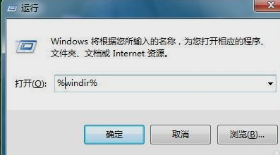
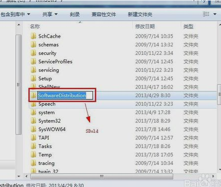
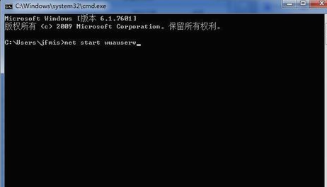
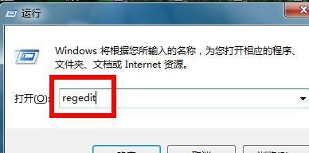
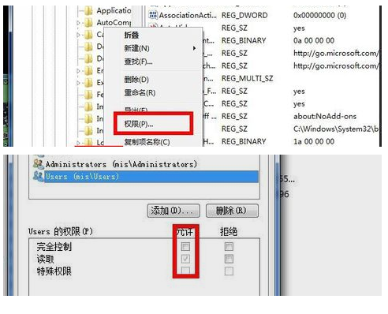
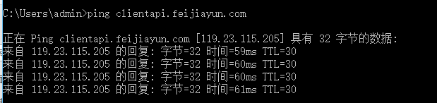
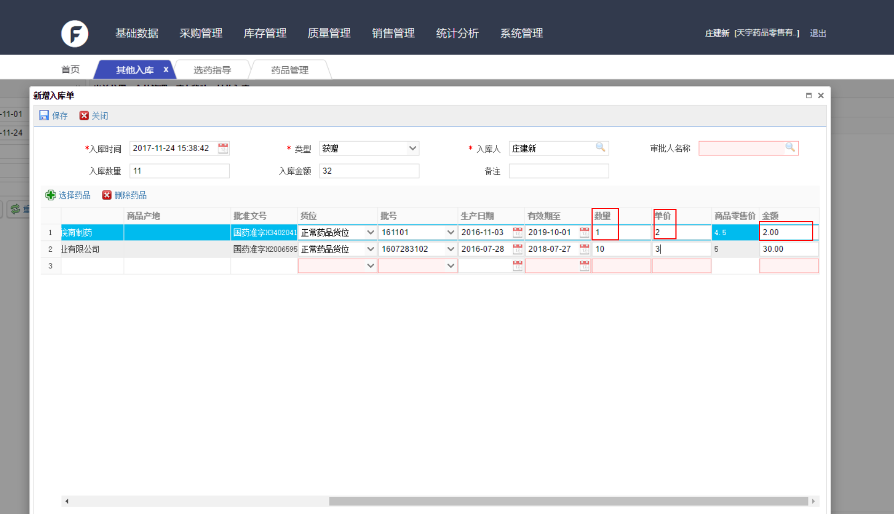

# 菲加云SaaS单体版本常见问题清单Q&A
<!-- TOC depthFrom:1 depthTo:6 withLinks:1 updateOnSave:1 orderedList:0 -->

- [菲加云SaaS单体版本常见问题清单Q&A](#菲加云saas单体版本常见问题清单qa)
	- [1.工作人员联系方式](#1工作人员联系方式)
		- [1.1 商务支持人员联系方式](#11-商务支持人员联系方式)
		- [1.2 技术人员联系方式](#12-技术人员联系方式)
		- [1.3 测试人员联系方式](#13-测试人员联系方式)
		- [1.4 产品人员联系方式](#14-产品人员联系方式)
	- [2.安装问题汇总](#2安装问题汇总)
		- [2.1 .net framework安装](#21-net-framework安装)
		- [2.2 账号开通](#22-账号开通)
		- [2.3 数据迁移](#23-数据迁移)
	- [3.前台销售系统](#3前台销售系统)
		- [3.1 数据同步失败](#31-数据同步失败)
		- [3.2 离线销售问题](#32-离线销售问题)
		- [3.3 会员优惠价格处理](#33-会员优惠价格处理)
	- [4.后台管理系统](#4后台管理系统)
		- [4.1 页面显示不全](#41-页面显示不全)
		- [4.2 数据导入导出](#42-数据导入导出)
		- [4.3 智能采购](#43-智能采购)
		- [4.4 集采活动](#44-集采活动)
		- [4.5 登录提示账号密码错误](#45-登录提示账号密码错误)
		- [4.6 添加新品，在首营审核无法查到](#46-添加新品在首营审核无法查到)
		- [4.7 添加新供货单位，在首营审核无法查到](#47-添加新供货单位在首营审核无法查到)
		- [4.8 采购订单搜索不到供货单位](#48-采购订单搜索不到供货单位)
		- [4.9 采购订单搜索不到药品](#49-采购订单搜索不到药品)
		- [4.10 快速收货保存错误](#410-快速收货保存错误)
		- [4.11 金额自动计算错误](#410-金额自动计算错误)

<!-- /TOC -->

## 1.工作人员联系方式
### 1.1 商务支持人员联系方式
- 李玮 ：13810150782
-	宋立 ：13141392863
-	白银燕：18701178767
-	范妙：18271911322
-	赵晨旭：15010086961
-	赵艳杰：13601049045
-	杲秀涛：18701686102
### 1.2 技术人员联系方式
-	李育廷：18793139543
-	张帆：18611623987
-	闫晨辉：18510293420
-	刘群：17743558575
### 1.3 测试人员联系方式
-	李壮：17343043097
### 1.4 产品人员联系方式
-	王鹏程：13520187264

## 2.安装问题汇总
### 2.1 .net framework安装
-	安装失败win7及以上尝试安装framework4.5
-	安装失败->进度条会变成安装回滚条，提示安装未完成解决办法：
	-	开始——运行——输入cmd——回车——在打开的窗口中输入net stop WuAuServ
	-       
	-	开始——运行——输入%windir%
	-       
	-	找到SoftwareDistribution的文件夹，重命名为Sdold
	-       
	-	开始——运行——输入cmd——回车——在打开的窗口中输入net start WuAuServ
	-       
	-	开始——运行——输入regedit——回车
	-       
	-	找到注册表,HKEY_LOCAL_MACHINE\SOFWARE\Microsoft\Internet Explorer下的MAIN子键，右击main后，在上面菜单中找到“编辑”--“权限”，点击后就会出现“完全控制”等字样，勾上即可放心安装
	-       
-	仍安装失败->阉割版的电脑已无药可救换电脑或重装系统吧

### 2.2 账号开通
-	药店开通账号需发送信息：
	-	药店企业名称
	-	药店注册地址
	-	药店联系人
	-	药店联系方式
	-	企业营业执照扫描件（照片）
	-	药店GSP证书扫描件（照片）
	-	药品经营许可证书扫描件（照片）
	-	注：诊所只需发送诊所扫描件（照片）即可。
-	信息发送给运营同事进行开通。
-	运营同事需要在MPH后台查询此药店是否开通MPH账号，如已开通MPH账号绑定UID（用户）和EID(企业）。

### 2.3 数据迁移

## 3.前台销售系统
### 3.1 数据同步失败
-	检查网络
	-	开始——运行——输入cmd——回车——在打开的窗口中输入ping clientapi.feijiayun.com -t 检查丢包情况,如果存在丢包状况请重启路由，如果仍丢包可让药店打投诉电话至当地运营商要求解决访问菲加云网址丢包状况
	-       
### 3.2 离线销售问题
-	商品检索为空
	-	后台确认药品状态是否启用
	-	基础数据->药品管理->检索药品->查看->药品状态
-	后台确认库存数最是否为0
	-	库存管理->库存明细->实时库存批次 或 商品-> 检索药品
-	后台确认库存批次是否不在有效期
	-	库存管理->商品批号修改->检索药品  查看有效期,如有效期小于30天了，请正确修改大于30天的。
-	销售订单丢失
	-	前台销售订单没有上传成功
	-	点F9键进行数据同步
	-	手动上传销售订单:POS->更多功能->销售上传 （确认是否在未上传列表里）选中重新上传，如果单子里有药品为红色 那请参考 销售订单上传失败处理
	-	检查流水号是否连续,跟销售员确认丢失单是否真的使用菲加云POS销售了
-	销售订单上传失败
	-	注意:因网络或其他因素造成销售单没上传上去，然后客户直接以盘点或其他出库销去了库存，再上传订单时部分商品库存不够减就会出现订单无法上传成功的事情，所以需要提醒客户，在盘点库存发现盘盈时先检查是否存在未上传销售单，如果存在需要先补传销售单后进行盘点过账，正常情况下订单同步正常时是不会盘盈那么频繁的
	-	库存不够:处里办法是 双击红色有问题药品，重新选择批次或货位 如提示库存不够请以下两点
	-		1.后台盘点库存不够药品 盘点数量：要大于 销售数量 。前台下载最新，重新处理红色有问题药品
	-		2.当库存为0时不能盘点只能快速收货 重新进一批与销售数量相同。
	-	修改过批号或货位:常出现，因为客户有可能后台改了批号或货位，前台没有同步且进行销售,处里办法是 双击红色有问题药品，进新重新选择批次或货位

### 3.3 会员优惠价格处理

## 4.后台管理系统
### 4.1 页面显示不全
-	如果整改页面为白色,无法显示系统,请打开360管家->系统修复->信任区->添加信任目录(选择菲加云安装目录)点击确认即可解决该问题
-	系统支持1024*768以上分辨率，包括1024*764
-	XP调整分辨率方法如下：
-	在电脑桌面的任意空白处点击右键-属性
	-	
-	点击设置
	-	
-	在设置里有一个屏幕分辨率，可以对数值进行调整
	-	
-	调整之后点击确定，电脑的分辨率就改变了
	-	
-	win7/win8 调整分辨率方法如下：
-	在屏幕的空白处点击鼠标右键，在下拉菜单中点击“屏幕分辨率”。
	-	
-	这时，会弹出“屏幕分辨率”对话框。如果想简单设置的话，可以点击对话框中“分辨率”后面的黑色小三角，在下拉菜单中拉动小滑块来设置分辨率。
	-	
-	win10调整分辨率方法如下：
-	在桌面空白处单击鼠标右键，弹出窗口选择显示设置打开进入
	-	
-	这个界面显示中，找到这里的高级显示设置进入，如图操作。
	-	
-	现在可以看到当前电脑显示器的分辨率
	-	
-	根据自己需要选择你要设置的分辨率，非常简单。
	-	
-	现在点击这里的应用按钮，让自己的设置生效。
	-	
-	当然这里出现的界面，如果想让自己的设置生效的话，这里点击保留更改。
	-	
### 4.2 数据导入导出
-	菜单功能上方为公告区域，包含导入、导出按钮：
-	数据导出：
	-	
	-	
-	数据导入：
	-	
-	下载导入模板
	-	
-	按照模板把数据整理完成，进行导入
	-	
	-	
-	由于部分模板包含样列，故所有导入模板都是从第4行数据开始导入数据。
### 4.3 智能采购
### 4.4 集采活动
### 4.5 登录提示账号密码错误
- 首先需要确定您的账号密码是否正确。尤其是企业账号，是否是完整的账号。账号后面是否有空格。
- 其次用户名是否正确，在后台中人员账号分为用户名和姓名，在登陆时是否填写的是用户名。
### 4.6 添加新品，在首营审核无法查到
- 在新增商品时，商品资料下方的首营标志需要选择是。默认状态下首营标志状态为是。
- 如果是已经添加的新品，那只能停用，在重新建立一个新品进行首营。
### 4.7 添加新供货单位，在首营审核无法查到
- 在新增供货单位时，供货单位资料下方的首营标志需要选择是。默认状态下首营标志状态为是。
- 如果是已经添加的供货单位，那只能停用，在重新建立一个供货单位进行首营。
### 4.8 采购订单搜索不到供货单位
- 在建立供货商资料后，需要进行首营审核操作，只有通过了首营审核的供货商，才能在采购订单时搜索到。
- 另外，如果门店停用了该供货商，在采购订单时，也会搜索不到，需要到供货商管理界面启用供货商。
### 4.9 采购订单搜索不到药品
- 首先，在采购订单或快速收货环节，需要先选好供货商才能搜索药品。如果没有选择供货商是搜索不到药品的。
- 其次，如果该供货商的经营范围没有勾选，那么该范围内的药品也无法搜到。
### 4.10 快速收货保存错误
- 在快速收货时，生产日期以及有效期必须是有效的时间格式。
- 您看看这两个位置是不是有时间不是标准的时间格式，标准时间格式，如`20170814`。
### 4.11 金额自动计算错误
- 金额自动计算不起作用。
  -       	
- 如果出现金额自动计算失效，如上图中，将鼠标停在数量或单价输入框里面，重新输入下对应的数据，就会自动计算。
